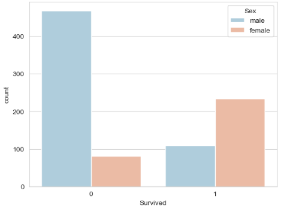
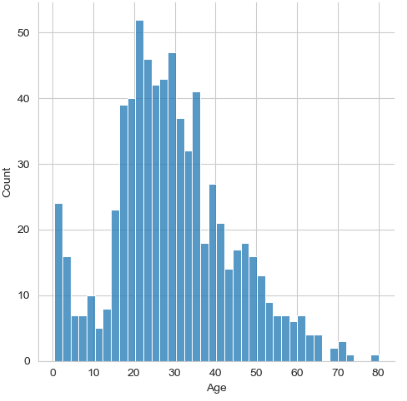
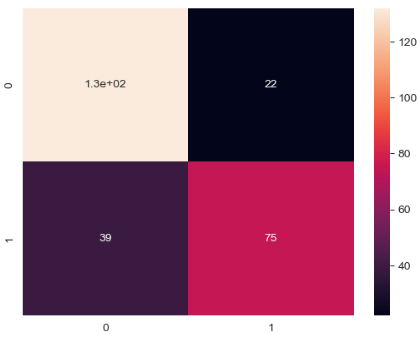
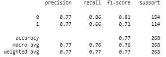

📌 1. Background & Problem Statement

  This project analyzes the classic Titanic dataset, containing information like age, sex, passenger class, fare, and more.
  The goal is to build a Logistic Regression model that predicts whether a passenger survived (1) or did not survive (0).
  
  The objectives include:
   -Understanding survival patterns
   -Cleaning missing data
   -Building a predictive model
   -Interpreting which features matter most

🔎 2. Approach Followed
  ✔ Data Exploration
   Inspected columns, missing values, and basic dataset structure.Performed EDA to analyze:
   Gender vs Survival
  
   
  
   ✔ Data Cleaning & Preparation
    Filled missing Age, Cabin, and Embarked values.Converted categorical features to numerical encodings.Selected relevant features for the model.
    Age distributions

   

   ✔ Building the Logistic Regression Model
    Split the dataset into training and testing sets.Trained a Logistic Regression model on selected features.Evaluated the model using:
    Confusion Matrix
    
  

  Accuracy Score and Classification Report

  ✔ Interpreting the Model
    Extracted coefficients to understand how each feature impacts survival probability.

💡 3. Insights Gained
  🧍‍♀️ Gender is a major predictor
   - Female passengers had a much higher likelihood of survival.
  🛏️ Passenger Class strongly influences survival
   - First-class passengers had the highest survival rate.
   - Third-class passengers had the lowest.
  🎒 Age plays an important role
   - Children and younger passengers had better survival chances.
   - Older age groups were less likely to survive.
  ⚓ Fare & Embarkation patterns
   - Higher fares → higher survival (correlated with higher classes).
   - Embarkation port had minor but noticeable trends.
  
  🧠 Model Performance
    * The model performs well for a simple logistic regression.
    * High precision for predicting non-survivors.
    * Good recall for identifying survivors depending on feature balance.
    
   Classifiaction Report
  
    
  
