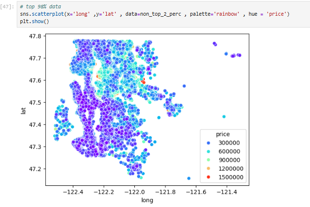
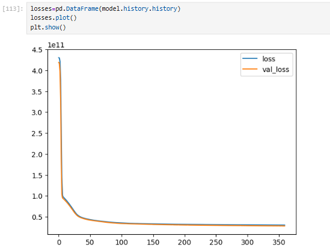

**🏠 House Price Prediction using Keras (Regression)**
*Overview*

This project builds a neural network regression model using Keras to predict house prices from structured real-estate data.
The goal is to walk through a complete machine learning workflow — from raw data exploration to model training, evaluation, and making real predictions.

*Dataset*: Source: kc_house_data.csv
*Target variable*: price
*Type*: Structured tabular data containing house attributes such as size, location, year built, renovation status, etc.

*Step-by-Step Breakdown*

1. Data Loading & Initial Inspection

The dataset is loaded using Pandas and quickly inspected to understand:

  - Column structure
  - Data types
  - Presence of missing values
  - Basic statistics
This sets the foundation before touching any modeling.

2. Exploratory Data Analysis (EDA)

EDA is used to understand how different features relate to house prices.

Key analyses include:

 - Price distribution
 - Relationship between living area and price
 - Geographic price patterns using latitude and longitude
 - Price differences for waterfront properties

This helps build intuition and guides later decisions like outlier removal and feature selection.

3. Outlier Handling

Extreme price values can heavily skew a regression model.

To reduce their impact:

  - The top ~2% of highest-priced houses are removed
    
    
    
  - Price distributions and geographic plots are revisited to confirm stability

     

This leads to a more reliable and generalizable model.

4. Feature Engineering

Several adjustments are made to improve learning: 

  - Dropped identifiers (id) that don’t add predictive value
  - Converted the date column into: year and month
  - Removed high-cardinality categorical features (zipcode) for simplicity

Analyzed features like basement size and renovation year to understand their influence
The result is a cleaner, more meaningful feature set.

5. Train–Test Split

The data is split into:

  - Training set (70%)
  - Testing set (30%)

This ensures model performance is evaluated on unseen data.

6. Feature Scaling

Neural networks are sensitive to feature scale.MinMaxScaler is appliedTraining data is fitted and transformedTest data is transformed using the same scaler
This ensures stable and faster convergence during training.

7. Model Building (Keras)

A Sequential neural network is built using Keras:

  -  Multiple hidden Dense layers with ReLU activation
  - Output layer with a single neuron for price prediction
  - Optimizer: Adam
  - Loss function: Mean Squared Error (MSE)

The architecture balances simplicity and expressive power.

8. Model Training

The model is trained over multiple epochs with:

  - Mini-batch gradient descent
  - Validation on test data during training

Training and validation loss are tracked to monitor learning behavior and detect overfitting.

9. Model Evaluation

Performance is assessed using:

  - RMSE (Root Mean Squared Error)
  - MAE (Mean Absolute Error)
  = Explained Variance Score
  - Visual checks include:
  - Loss curves over epochs
  - Actual vs predicted price scatter plots

These help judge both numerical accuracy and real-world behavior.

10. Making Predictions

Finally:A single house sample is scaled.The trained model predicts its price.This demonstrates how the model would be used in practice.

Future Improvements

  - Hyperparameter tuning (layers, neurons, learning rate)
  - Regularization (Dropout / L2)
  - Better handling of categorical variables (e.g., zipcode encoding)
  - Cross-validation for more robust evaluation
  - Log-transforming price to handle skewness
