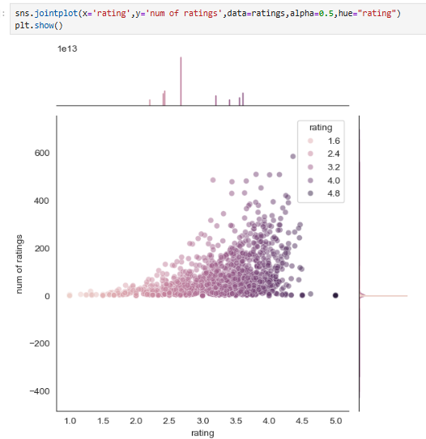

**Overview**:
  This project demonstrates a simple movie recommendation system using user rating correlations.
  It uses the MovieLens dataset (u.data for user ratings Movie_Id_Titles for movie names) and Python libraries (Pandas, NumPy) to analyze ratings data. 
  The notebook loads and merges the data on movie ID, computes average ratings and counts per movie, then builds a user–item rating matrix.
  Two example movies (“Star Wars (1977)” and “Liar Liar (1997)”) are chosen (they have 584 and 485 ratings, respectively) to illustrate the method.

**Tools Used**:

 - Python 3
 - Pandas (for data loading and manipulation)
 - NumPy (for numerical operations)
 - Jupyter notebook (to run the analysis interactively)

**How It Works**:

  1) Data Loading: The code reads the ratings file (u.data) and the movie titles file, then merges them to get a combined DataFrame of (user, movie, rating, title).
  
  2) Statistics: It groups by movie title to compute each movie’s average rating and total number of ratings. For example, “Star Wars (1977)” has 584 ratings (mean ~4.36) and
      “Liar Liar (1997)” has 485 ratings.

     
  
  4) User–Item Matrix: A pivot table (moviemat) is created with users as rows and movie titles as columns (entries are ratings). Missing ratings are NaN.
  
  5) Similarity Calculation: For each example movie, the code takes its column of user ratings and computes the Pearson correlation (.corrwith) with
     all other movie columns. This yields a correlation score between the chosen movie’s ratings and every other movie.
  
  6) Filtering: To avoid spurious results from rarely rated movies, the notebook filters out any movie with fewer than 100 ratings.
  
  Output: The result is a list of movies most “similar” in rating pattern to the chosen examples. After filtering, the top matches for “Star Wars (1977)” 
  include its sequels and other sci-fi hits – e.g. “Empire Strikes Back” and “Return of the Jedi” appear as highly correlated. For “Liar Liar (1997)”, 
  the closest matches include “Batman Forever” and “The Mask” (other 90s comedies). In short, the notebook shows how to use simple collaborative filtering: given a movie title, 
  it finds other movies with similar user-rating profiles (based directly on the available ratings data).
  
**Result Example (Top Similar Movies)**:
  
  Star Wars (1977) → Empire Strikes Back (1980), Return of the Jedi (1983), etc.
  Liar Liar (1997) → Batman Forever (1995), The Mask (1994), etc.
